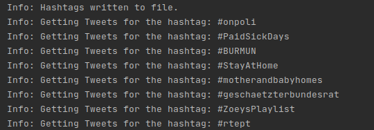
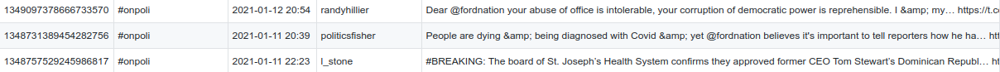
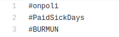

# Ultron: A Twitter Bot

[](https://github.com/olmaneuh/ultron-a-twitter-bot/issues)
[](https://github.com/olmaneuh/ultron-a-twitter-bot/network)
[](https://github.com/olmaneuh/ultron-a-twitter-bot/stargazers)
[](https://github.com/olmaneuh/ultron-a-twitter-bot/blob/main/LICENSE)

Ultron is a Twitter bot that can fetch trending hashtags and tweets of different geographical locations.

<table>
  <tr>
    <td>The following image shows an example of the bot running, notifying the user of the ongoing steps.</td>
  </tr>
  <tr>
    <td></td>
  </tr>
</table>

<table>
  <tr>
    <td>Example of the tweets file. You can review the following file: <a href="https://github.com/olmaneuh/ultron-a-twitter-bot/blob/main/trending_tweets/2021-01-12-tweets.csv">trending_tweets/2021-01-12-tweets.csv</a></td>
  </tr>
  <tr>
    <td></td>
  </tr>
</table>

<table>
  <tr>
    <td>Example of the hashtag file. You can review the following file: <a href="https://github.com/olmaneuh/ultron-a-twitter-bot/blob/main/trending_tweets/2021-01-12-hashtags.csv">trending_tweets/2021-01-12-hashtags.csv</a></td>
  </tr>
  <tr>
    <td></td>
  </tr>
</table>

## Requirements

* **Twitter developer account:** To access Twitter APIs you must have a Twitter developer account, 
  if you don't have it you can apply [here](https://developer.twitter.com/en/apply-for-access).
  It's important to consider the rate limits on Twitter requests based on the developer account _(free or premium)_, 
  they vary in how many requests you can do. Please review the documentation 
  [here](https://developer.twitter.com/en/docs/rate-limits).
  
* **Python 3:** The bot is built in Python 3, to execute it you need Python 3.6 installed or latest.
  ```
  sudo apt-get update
  sudo apt-get install python3 python3-dev python3-venv
  ```
  For more information about how to install Python 3  and Virtual Environments check the following links:
  * https://www.python.org/downloads/
  * https://docs.python.org/3/tutorial/venv.html


## Set Up And Getting Started

1. Clone the repository ``` git clone ... ```.
2. Change location to project directory ```cd ultron-a-twitter-bot```
3. Update the ```config.json``` file with your ```API_KEY``` and ```API_SECRET``` from your Twitter developer account.
4. Create and enable a virtual environment. 
    ```
    python3 -m venv venv
    source venv/bin/activate
    ```
5. Run ```pip install -r requirements.txt``` to install project dependencies.
6. Run the project ```python3 main.py```.


## Use Cases

You can use the collected data to do data analysis based on trends or hashtags, you can also build a machine learning 
model to do sentiment analysis for tweets. To study tweets, you must first collect many of them, the bot helps this 
process to be done automatically.


## Authors

Olman Ureña


## License

This project is licensed under the Apache License v2.0 - see the [LICENSE](LICENSE) file for details.
